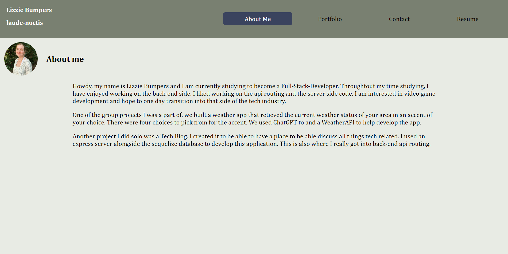

# Lost-Colony

## Description
This webpage is created to act as a resume using reactjs. It is used to show some of my works and to be able to contact me. There is a section depicting my proficiencies in coding alongside my profession resume in which you can download.  

Vite was used to build the server.

## Live Webpage
https://main--bumpersresume.netlify.app/  

## APIs and NPMs
[Font Awesome for Icons](https://cdnjs.com/libraries/font-awesome)  
[Vite](https://www.npmjs.com/package/vite)  
[React](https://www.npmjs.com/package/react) (Including the react-dom and react-router-dom)    
[Eslint](https://www.npmjs.com/package/eslint)

## Credits
[Navbar Help](https://www.youtube.com/watch?v=17l6AOc8s10&t=329s)  

## Screenshot
